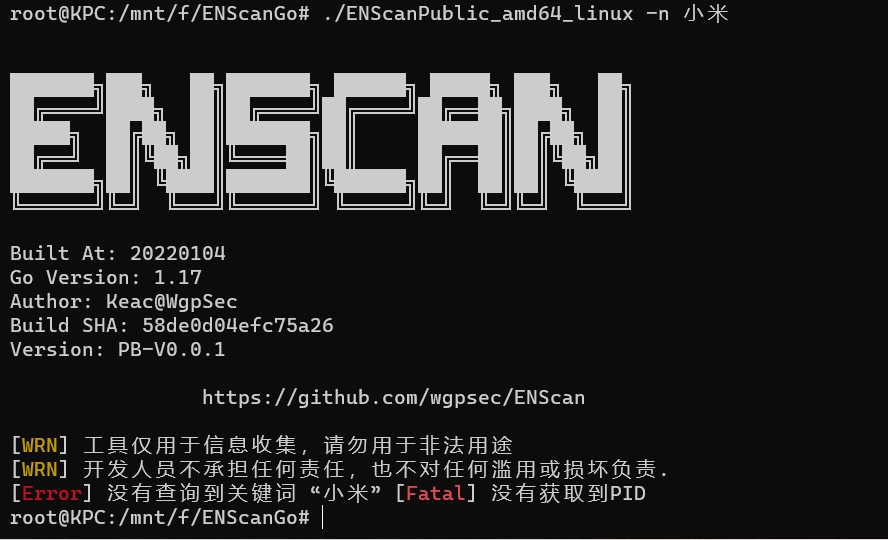
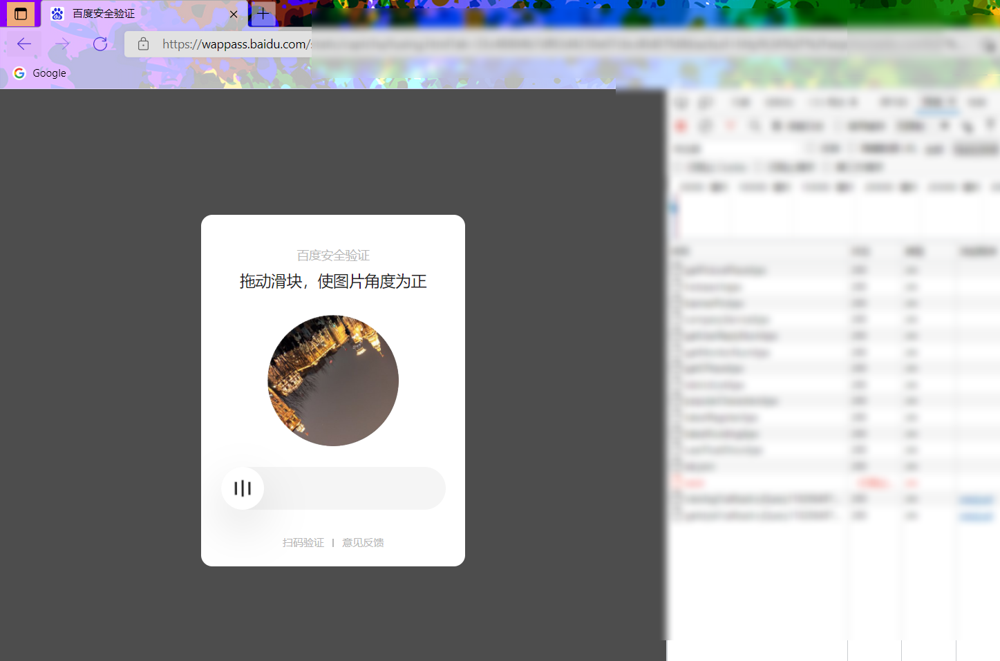
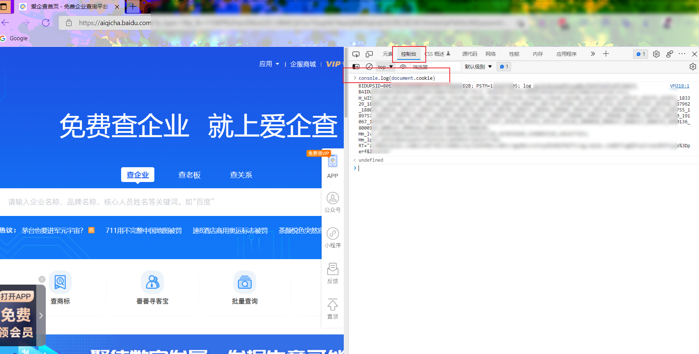
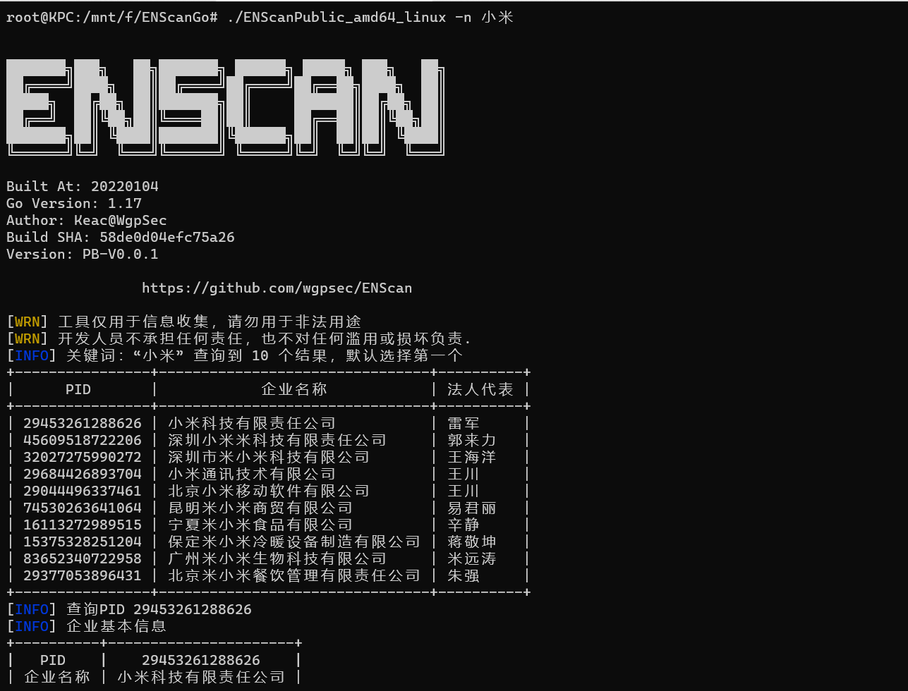
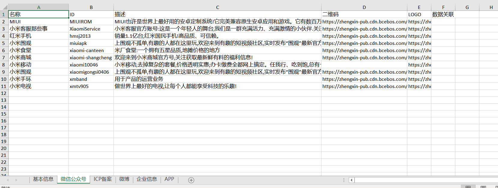
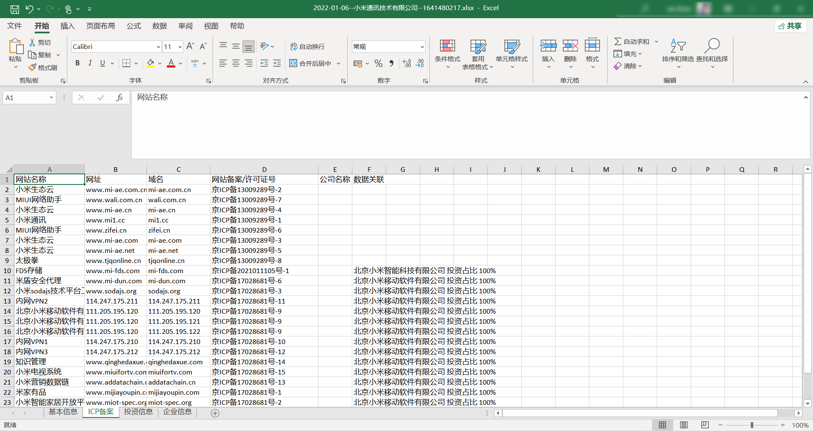

# ENScan_GO

ENScanGo 是现有开源项目 [ENScan](https://github.com/wgpsec/ENScan) 的升级版本，为避免滥用导致API失效，目前仅开源部分代码供参考！


<p align="center">
  <a href="https://github.com/wgpsec/ENScan_GO">
    
  </a>

  <h3 align="center">ENScan的Go版本实现</h3>
  <p align="center">
    解决遇到的各种针对国内企业信息收集难题
    <br />
    <a href="https://github.com/wgpsec/ENScan_GO"><strong>探索更多Tricks »</strong></a>
    <br />
    <br />
    <a href="https://github.com/wgpsec/ENScan_GO/releases">下载可执行文件</a>
    ·
    <a href="https://github.com/wgpsec/ENScan_GO/issues">反馈Bug</a>
    ·
    <a href="https://github.com/wgpsec/ENScan_GO/issues">提交需求</a>
  </p>


### 功能列表

 - 使用支持以下API，并支持合并数据导出
    - 爱企查
    - 天眼查
    - 企查查（暂未开放）
    - 阿拉丁
    - 酷安
    - 小蓝本（暂无办法破解签名，有兴趣大佬一起交流~）

 - 查询信息
    - ICP备案
    - APP
    - 微博
    - 微信公众号
    - 控股公司
    - 供应商
    - 客户信息
    - 小程序
    - 控股X的公司的以上所有信息
    - ...
 - 通过APK市场收集使用信息

### 使用指南

命令行参数如下
```
  -branch 查询分支机构（分公司）信息
  -f keyword.txt 包含公司关键词的文件一行一个
  -field website,weibo,wechat 获取字段信息 eg website
  -i string 公司ID（根据你查询的type不同ID不同）
  -invest-num 100 投资比例 eg 100
  -invest-rd 投资比例不明确（可能不是完全控股）
  -is-group 查询集团信息
  -is-pid 批量查询文件是否为PID
  -n 小米 公司名称关键词 eg 小米
  -type string 收集渠道信息（默认爱企查） (default "aqc")
  -v    版本信息
```

字段支持:

```
"website", "weibo", "wechat", "app", "weibo", "job", "wp", "copyright"
```

#### 快速使用

首先需要生成配置文件，在目录下会生成 `config.yaml` 的配置文件

```shell
./ENScanPublic_amd64_linux -v
```

配置信息如下

```yaml
version: 0.1 			# 请勿修改版本号！
common:
  output: ""            # 导出文件位置
  field: [ ]			# 查询字段 如["website"]
cookies:
  aiqicha: ''           # 爱企查   Cookie
  tianyancha: ''        # 天眼查   Cookie
  qcc: ''               # 企查查   Cookie
  aldzs: ''             # 阿拉神灯 Token
  xlb: ''               # 小蓝本   Token

```

生成配置文件之后即可开始信息收集

Eg：快速收集小米相关信息 默认收集：企业基本信息、微博、ICP备案、APP、微信公众号

```shell
./ENScanPublic_amd64_linux -n 小米
```



你可能会遇到如下情况，需要填写Cookie 以爱企查（默认收集源）为例

打开 aiqicha.baidu.com



通过滑动验证后可以正常打开网站，在console（控制台）输入 `console.log(document.cookie)` 或其他方式获取全部Cookie并粘贴至配置文件 `''`中



这时候再重复命令即可查看到结果，注意如果信息中含有 `*`，你需要登陆后获取Cookie才能去除`*`信息



[](https://asciinema.org/a/460250)



### 场景使用

#### 只想获取备案信息

```shell
./ENScanPublic_amd64_linux -n 小米  -field website
```

[](https://asciinema.org/a/460252)

#### 获取占股100的子公司下所有ICP备案网站

```
./ENScanPublic_amd64_linux -n 小米通讯 -invest-num 100 -field website
```



[](https://asciinema.org/a/460255)

